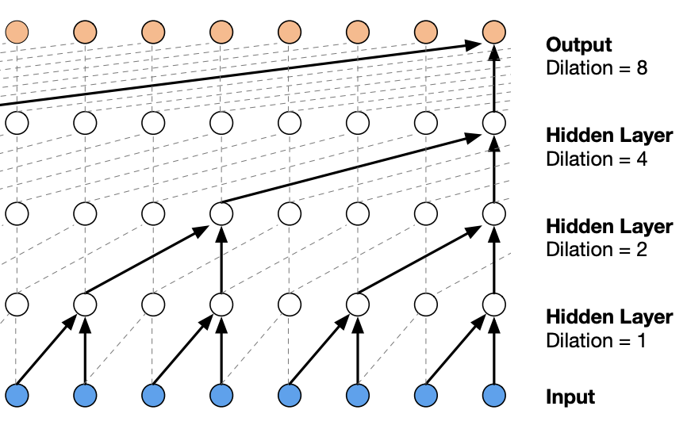

<p align="center">

  <h1 align="center">Automatic Music Generation using AI </h1>
  <h2> Shaantanu Kulkarni - </h2>
  <h3> Vijay Kalluri - vijay13aba </h3>
  <p align="center">
    An automatic music generation model which has been  trained on schubert piano tones  can be used to generate piano music .
    <br />
    
  </p>
</p>


<!-- TABLE OF CONTENTS -->
<details open="open">
  <summary>Table of Contents</summary>
  <ol>
    <li>
      <a href="#about-the-project">About The Project</a>
      <ul>
        <li><a href="#built-with">Built With</a></li>
      </ul>
    </li>
    <li>
      <a href="#getting-started">Getting Started</a>
      <ul>
        <li><a href="#prerequisites">Prerequisites</a></li>
        <li><a href="#installation">Installation</a></li>
      </ul>
    </li>
    <li><a href="#usage">Usage</a></li>

  </ol>
</details>


<!-- ABOUT THE PROJECT -->
# About The Project

In this project we have created a LSTM based model which takes in a seed input in form of notes ,32 notes in particular. It then predicts future notes as required.  We had experimented with two types of models for this project. 
* LSTM based RNN model
* 1D convolution based model with skip connections and Residual networks inspired from Wavenet architechture

##  LSTM Based Model

Long Short-Term Memory (LSTM) networks are a type of recurrent neural network capable of learning order dependence in sequence prediction problems. A typical LSTM cell looks like one shown below:

 

These cells are then linked in chain form to form a LSTM network. These LSTM networks are then stacked upon one another such that output of one chain is input to the other.
Complete LSTM model description can be found in Model/LSTM.py.

<br>

## 1D Convolution based Wavenet inspired Model

1D convolutions are similar to 2D convolutions if you are familiar with CNNs. Such 1D convolutional networks can be used to train models as an efficient alternative to recurrent neural networks. Wavenets use modified version of these 1D convolutions called as Dilated convolutions. Dilated convolutions help in increasing the  receptive field of the network.

 

These convolutions layers when used with proper padding can be stacked and used along with residual connections and skip connections and then passed to fully connected layers to predict next musical note.

### Wavenet architechture

 

The complete description of the wavenet based model can be found in Models/Wavenet.py

<hr>
After experimenting with both the models , we observed that Wavenet model was a bit complex for training piano musical notes. It trained properly but the training process was a bit time consuming. Although we tested the Wavenet model to predict simple sinosoids , to test its validity ,  with varying frequencies and it performed very well on them.
<p>

We finally decided to go with LSTM based model.<br>
### Training details
* The model was trained on GeForce GTX 1080 Ti GPU for about 2.5 - 3 hours .
* The complete output training log can be found in /op_file.txt
* In initial 25 epoch , we predicted only the next note; from epoch 25 to epoch 44 next 4 notes were predicted and from epoch 45 to epoch 90, next 8 notes were predicted.
### Loss History
<div style="text-align:center">

</div>

### Training Accuracy 

<table>
  <tr>
    <th>Mode</th>
    <th>Correct predictions</th>
    <th>Total predictions</th>
    <th>Accuracy</th>
  </tr>
  <tr>
    <td>Training</td>
    <td>406824 </td>
    <td>448760</td>
    <td>90.65513</td>
  </tr>
  <tr>
    <td>Validation</td>
    <td>110044 </td>
    <td>128224 </td>
    <td>85.82168 </td>
  </tr>
  <tr>
    <td>Testing</td>
    <td>55016</td>
    <td>64112</td>
    <td>85.81232</td>
  </tr>
</table>


</p>
<hr>

# Results
All the generated music files can be found in /Outputs directory  . These files are stored as .mid extensions. Instructions to play these files have been given below.

I converted some of them to MP3 and changed the speed since the predicted notes are mere notes and have no sense of tempo. Enjoy listening to the melodious beats :wink:
<br>
<span style="font-size:20px">
<a href="https://soundcloud.com/shaantanu-kulkarni/music9-mp3cutnet">Track 1</a><br>
<a href="https://soundcloud.com/shaantanu-kulkarni/music3-mp3cutnet">Track 2</a><br>
<a href="https://soundcloud.com/shaantanu-kulkarni/music0-1-mp3cutnet">Track 3</a>
</span>


### Built With

The following technologies were used to build the project
* [Pytorch](https://pypi.org/project/pytorch/)
* [Tensorflow](https://pypi.org/project/tensorflow/)
* [Music21](https://pypi.org/project/music21/)


<!-- GETTING STARTED -->
## Getting Started

### Installation

1. Clone the repository
   ```sh
   git clone https://github.com/shaantanu314/Music-Gen-AI.git
   ```
2. Create and Activate Virtual Environment 
    ```sh
    cd Music_Gen_AI
    python3 -m venv /path_to_new_virtual_environment
    source /path_to_new_virtual_environment/venv/bin/activate
    ```
3. Install the dependancies
   ```sh
   pip3 install requirements.txt
   ```


 You can either train your own model by running train.py 
 ```sh
 python3 train.py
 ```

 If you want to run Notebook version of the training code , you can start a jupyter server and start training in jupyter notebook
 ```sh
 cd Music_Gen_AI
 jupyter notebook
 ```
 Now open the Music_Gen_AI_Train.ipynb notebook.

### Running Testing notebook
 If you want to test the results on our pretrained model stored in /Trained_Models you can open Music_Gen_AI_Test.ipynb notebook on jupyter server.

All the outputs will be stored as .midi files in Outputs directory. To Listen to these raw midi files you need timidity.

```sh
sudo apt-get update
sudo apt-get install timidity
#to run the music1.mid file
timidity music1.mid
```

If you want to listen to the mp3 version , you can use online midi to mp3 converters like 
<br>
<a href="https://www.onlineconverter.com/midi-to-mp3">Online Midi to MP3 converter</a><br>
Since the music generated is are notes and there is no sense of tempo, we can used online tools to speed up the mp3 music and listen to the melodious piano beats.

<a href="https://mp3cut.net/change-speed">MP3 Speed changer</a>
